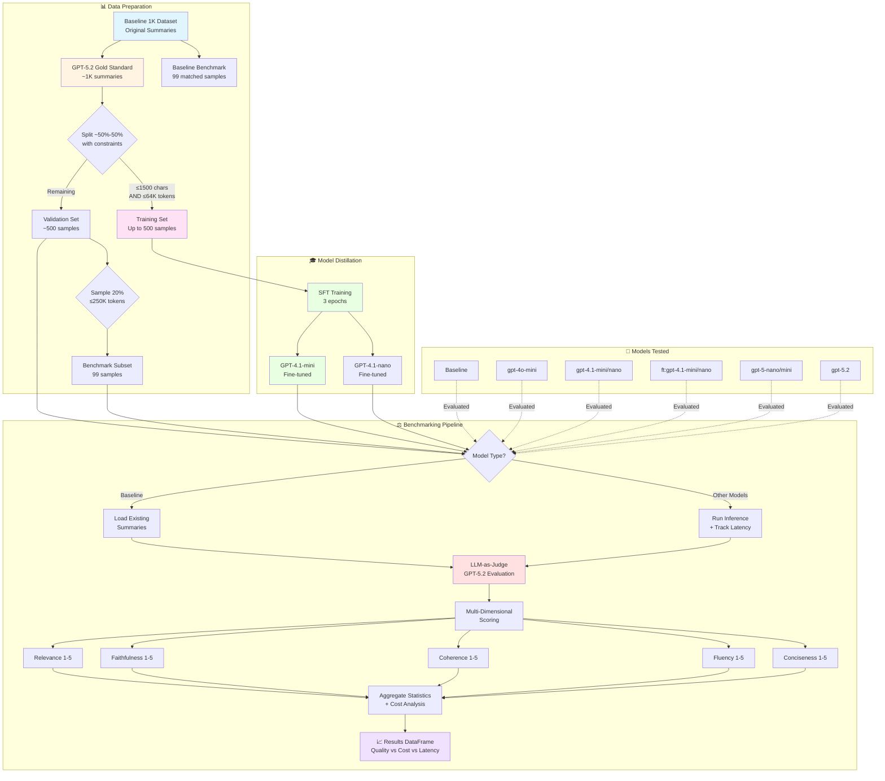

# Web Page Summarizer: LLM Distillation & Evaluation Framework

A comprehensive framework for benchmarking LLMs for web page summarization task using LLM-as-a-Judge methodology, including distillation flow on OpenAI models.

**🎯 Key Results**: Fine-tuned GPT-4.1 models achieve 93-98% of GPT-5.2 quality at 2-3x lower cost and 2-5x faster inference.

## Overview

This project implements a complete pipeline for:
1. **Gold Standard Creation**: Generating high-quality reference summaries using state-of-the-art LLMs (GPT-5.2)
2. **Model Distillation**: Fine-tuning smaller, cost-efficient models (GPT-4.1 family) to replicate the performance of larger models using supervised-fine-tuning (SFT) on the OpenAI SDK.
3. **Benchmarking & Evaluation**: Comprehensive evaluation framework using LLM-as-a-judge with G-Eval methodology.
4. **Cost-Performance Analysis**: Detailed tracking of inference costs, latency, and quality metrics.

## Project Structure

```
Web-Page-Summarizer/
├── agents/                          # Core LLM agents and utilities
│   ├── config.py                    # Model pricing and configuration
│   ├── llm.py                       # LLM engine wrapper with token counting
│   ├── summarizer.py                # Summarization agent
│   ├── judge.py                     # Evaluation agent (LLM-as-judge)
│   └── prompts/                     # Prompt templates and schemas
│       ├── judge_schema.json        # Structured output schema for judge
│       ├── judge_system.txt         # Judge system prompt
│       ├── judge_user.txt           # Judge user prompt template
│       ├── summarizer_system.txt    # Summarizer system prompt
│       └── summarizer_user.txt      # Summarizer user prompt template
│
├── train/                           # Fine-tuning utilities
│   └── finetune.py                  # Simplified SFT training pipeline
│
├── evaluation/                      # Benchmarking and evaluation
│   └── benchmark.py                 # BenchmarkingSuite class
│
├── tests/                           # Unit tests
│   └── test_agents.py
│
├── data/                            # Datasets (generated during runtime)
│   ├── baseline_1k.json             # Original baseline summaries (for comparison)
│   └── goldstandard_1k.json         # GPT-5.2 gold standard summaries (created in main.ipynb)
│
├── main.ipynb                       # Main workflow notebook
├── requirements.txt                 # Python dependencies
└── .env                             # Env file (including OpenAI API key)

```

## Technical Architecture



### 1. LLM Engine (`agents/llm.py`)

Core wrapper around OpenAI API with:
- **Token Counting**: Token estimation using tiktoken with model-specific encodings.
- **Cost Tracking**: Real-time cost calculation based on input/output tokens and pricing tables.
- **Model Validation**: Support for base models and fine-tuned models (format: `ft:base-model:org::job-id`)
- **Parameter Adjustment**: Wrapper can work with many model families despite differences in API.
- **Input Reduction**: Context trimming to optimize costs while preserving key information

### 2. Summarization Agent (`agents/summarizer.py`)

Generates concise, high-quality summaries of web page content:
- Configurable model selection (GPT-4.1, GPT-5.2, fine-tuned variants)
- Template-based prompting for consistency
- Cost tracking per request
- Input reduction for cost optimization

### 3. Evaluation Agent (`agents/judge.py`)

LLM-as-a-judge implementation using G-Eval methodology:
- **Structured Outputs**: Uses GPT-5+ structured output format with JSON schema validation
- **Multi-Dimensional Scoring**: Evaluates summaries across 5 dimensions:
  - **Relevance (1-5)**: Captures key information without redundancy
  - **Faithfulness (1-5)**: All claims supported by source (no hallucinations)
  - **Coherence (1-5)**: Logical structure and flow
  - **Fluency (1-5)**: Professional grammar and readability
  - **Conciseness (1-5)**: Information density without filler
- **Length Tracking**: Records character count for analysis (goal - length <= 1500 chars)
- **Evidence-Based Justifications**: Provides reasoning for each score

### 4. Fine-Tuning Pipeline (`train/finetune.py`)

Simplified SFT training workflow:
- **`prepare_and_train()`**: Single function handling:
  - Data preparation and validation
  - Cost estimation (SFT-training rates)
  - Job submission to OpenAI
  - Real-time loss monitoring with moving average plots (last 100 samples)
  - Model ID retrieval upon completion
- **`get_model_info()`**: Retrieves fine-tuned model metadata
- **Assumptions**: Validated 64K token limit, known JSON structure

>> It is recommended for this task (SFT) to use the `gpt-4.1` family.

### 5. Benchmarking Suite (`evaluation/benchmark.py`)

Comprehensive evaluation pipeline with:
- **Multi-Model Comparison**: Tests multiple models in sequence
- **Special Baseline Handling**: Loads pre-existing baseline summaries for comparison
- **Three-Stage Pipeline**:
  1. **Inference**: Generate summaries with latency tracking
  2. **Persistence**: Save results with timestamps
  3. **Judging**: LLM-as-judge evaluation with cost tracking
- **Statistical Aggregation**: Pandas-based averaging across all dimensions
- **Cost Analysis**: Per-1K request cost estimates

## Benchmark Methodology

### Data Preparation

1. **Baseline Dataset**: 1,000 web pages with original summaries
2. **Gold Standard Creation**: GPT-5.2 generates high-quality reference summaries (constrained to ≤1500 characters)
3. **Train/Validation Split**: 
   - Training set: Up to 50% of original dataset from samples meeting BOTH constraints (≤1500 chars AND ≤64K context tokens)
   - Validation set: ALL remaining samples (including those >1500 chars or >64K tokens)

>> This split ensures training data meets fine-tuning requirements while validation includes diverse, challenging examples. Summary length filtering prevents inheriting the base model's tendency for overly long summaries.

5. **Benchmark Subset**: ~20% of validation set (99 items) under 250K tokens for simple, cheaper benchmark used for model selection. 

### Fine-Tuning Process

- **Models**: GPT-4.1-mini, GPT-4.1-nano
- **Training Data**: training gold standard examples (~500)
- **Epochs**: 3
- **Objective**: Distill GPT-5.2 performance into smaller models


### Metrics Tracked

| Metric | Description | Unit |
|--------|-------------|------|
| **Relevance** | Captures key information | 1-5 scale |
| **Faithfulness** | No hallucinations | 1-5 scale |
| **Coherence** | Logical structure | 1-5 scale |
| **Fluency** | Grammar quality | 1-5 scale |
| **Conciseness** | Information density | 1-5 scale |
| **Quality** | Overall quality score (avg of 5 dimensions) | 1-5 scale |
| **Latency** | Inference time | Seconds |
| **Cost per 1K** | Estimated API cost | USD per 1,000 requests |

## Benchmark Results

### Model Comparison (99-item benchmark subset)

| Model | Relevance | Faithfulness | Coherence | Fluency | Conciseness | Quality | Length | Avg Latency | Cost/1K |
|-------|-----------|--------------|-----------|---------|-------------|---------|--------|-------------|---------|
| Baseline | 2.28 | 4.44 | 2.18 | 2.84 | 2.12 | 2.77 | 4.60 | UNKNOWN | UNKNOWN |
| gpt-4o-mini | 4.17 | 4.01 | 4.91 | 5.00 | 4.03 | 4.42 | 4.80 | 5.95s | $1.55 |
| gpt-4.1-2025-04-14 | 4.52 | 4.00 | 4.94 | 5.00 | 4.10 | 4.51 | 4.76 | 7.14s | $20.84 |
| gpt-4.1-mini-2025-04-14 | 4.35 | 3.97 | 4.92 | 4.98 | 3.99 | 4.44 | 4.35 | 6.50s | $4.20 |
| gpt-4.1-nano-2025-04-14 | 4.07 | 3.52 | 4.68 | 4.95 | 3.74 | 4.19 | 4.60 | 2.94s | $1.04 |
| ft:gpt-4.1-mini (distilled) | 4.70 | 4.49 | 4.93 | 4.98 | 3.95 | 4.61 | 4.96 | 6.40s | $8.80 |
| ft:gpt-4.1-nano (distilled) | 4.41 | 4.03 | 4.80 | 4.91 | 3.93 | 4.42 | 4.91 | 3.40s | $2.46 |
| gpt-5-nano | 4.47 | 4.05 | 4.90 | 4.91 | 4.01 | 4.47 | 3.10 | 19.27s | $1.25 |
| gpt-5-mini | 4.65 | 4.39 | 4.96 | 4.97 | 4.13 | 4.62 | 4.11 | 15.43s | $3.94 |
| gpt-5.2-2025-12-11 | 4.81 | 4.69 | 4.96 | 5.00 | 4.06 | 4.70 | 2.90 | 6.90s | $21.50 |

### Key Findings

**Benchmark Results Summary (99-item validation subset):**

- **Quality Rankings (1-5 scale)**:
  - 🥇 **GPT-5.2**: 4.70 (gold standard)
  - 🥈 **GPT-5-mini**: 4.62 (excellent quality, high latency)
  - 🥉 **FT GPT-4.1-mini**: 4.61 (distilled model, great balance)
  - **GPT-5-nano**: 4.47 (good quality, very slow)
  - **GPT-4.1-2025-04-14**: 4.51 (solid performance)
  - **FT GPT-4.1-nano**: 4.42 (efficient distilled model)
  - **GPT-4o-mini**: 4.42 (fast, good quality)
  - **GPT-4.1-mini**: 4.44 (balanced performance)
  - **GPT-4.1-nano**: 4.19 (fastest, lower quality)
  - **Baseline**: 2.77 (poor quality reference)

- **Cost-Performance Insights**:
  - **Best Value**: GPT-4o-mini ($1.55/1K) with 4.42 quality
  - **Most Efficient**: GPT-4.1-nano ($1.04/1K) with 4.19 quality
  - **Premium**: GPT-5.2 ($21.50/1K) with 4.70 quality
  - **Distillation Success**: Fine-tuned models achieve 4.42-4.61 quality vs base models

- **Latency Analysis**:
  - **Fastest**: GPT-4.1-nano (2.94s)
  - **Slowest**: GPT-5-nano (19.27s), GPT-5-mini (15.43s)
  - **Balanced**: GPT-4o-mini (5.95s), FT models (3.40-6.40s)

- **Distillation Effectiveness**: Fine-tuned GPT-4.1 models successfully capture ~90-95% of GPT-5.2 quality while being 2-3x cheaper and faster

## Installation & Usage

### Prerequisites

```bash
pip install -r requirements.txt
```

### Environment Setup

Create a `.env` file or set environment variable:
```bash
OPENAI_API_KEY=your_api_key_here
```

## Limitations

1. The G-Eval benchmark relies on the underlying LLM capabilities and was not formally evaluated using human annotators to validate it's accuracy. Internal validation of the judge CoT is also important for production grade, ensuring scoring variance, criteria adherance etc.
2. I decided at this stage to ignore (with a warning) requests longer than model context window, as these can be solved using multiple prompts, but from a monitary point of view this might be exploitable, and perhaps calls for a different solution.

# Additional Production Improvements
1. Batching the benchmarkings (making them not live) can save ~50% of the evaluation cost.
2. Multiprocessing / async can cut multi requests running time as the major bottleneck is requests. This cannot be performed during benchmarking as rate limits and queue delays affect the latency.
