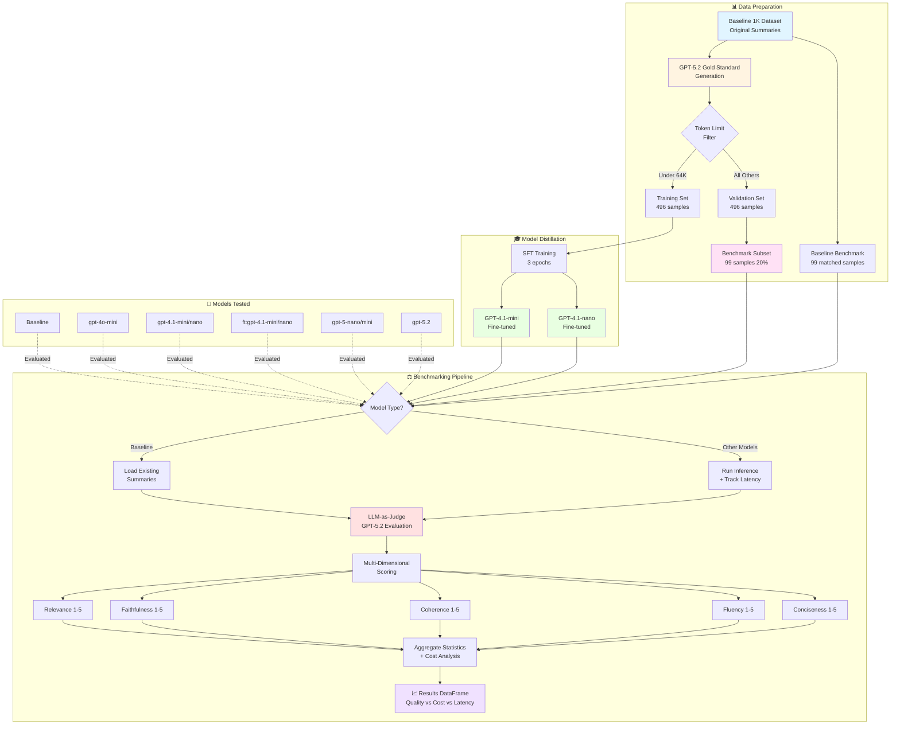

# Web Page Summarizer: LLM Distillation & Evaluation Framework

A framework for web page summarization designated to optimize performance, latency and cost.

## Overview

This project implements a complete pipeline for:
1. **Gold Standard Creation**: Generating high-quality reference summaries using state-of-the-art LLMs (GPT-5.2)
2. **Model Distillation**: Fine-tuning smaller, cost-efficient models (GPT-4.1 family) to replicate the performance of larger models using supervised-fine-tuning (SFT) on the OpenAI SDK.
3. **Benchmarking & Evaluation**: Comprehensive evaluation framework using LLM-as-a-judge with G-Eval methodology.
4. **Cost-Performance Analysis**: Detailed tracking of inference costs, latency, and quality metrics.

## Project Structure

```
Web-Page-Summarizer/
├── agents/                          # Core LLM agents and utilities
│   ├── __init__.py
│   ├── config.py                    # Model pricing and configuration
│   ├── llm.py                       # LLM engine wrapper with token counting
│   ├── summarizer.py                # Summarization agent
│   ├── judge.py                     # Evaluation agent (LLM-as-judge)
│   └── prompts/                     # Prompt templates and schemas
│       ├── judge_schema.json        # Structured output schema for judge
│       ├── judge_system.txt         # Judge system prompt
│       ├── judge_user.txt           # Judge user prompt template
│       ├── summarizer_system.txt    # Summarizer system prompt
│       └── summarizer_user.txt      # Summarizer user prompt template
│
├── train/                           # Fine-tuning utilities
│   └── finetune.py                  # Simplified SFT training pipeline
│
├── evaluation/                      # Benchmarking and evaluation
│   └── benchmark.py                 # BenchmarkingSuite class (inference -> judge)
│
├── tests/                           # Unit tests
│   ├── __init__.py
│   └── test_agents.py
│
├── data/                            # Datasets (generated during runtime)
│   ├── baseline_1k.json             # Original baseline summaries (for comparison)
│   └── goldstandard_1k.json         # GPT-5.2 gold standard summaries
│
├── main.ipynb                       # Main workflow notebook
├── requirements.txt                 # Python dependencies
└── .env                             # Env file (including OpenAI API key)

```

## Technical Architecture



### 1. LLM Engine (`agents/llm.py`)

Core wrapper around OpenAI API with:
- **Token Counting**: Token estimation using tiktoken with model-specific encodings.
- **Cost Tracking**: Real-time cost calculation based on input/output tokens and pricing tables.
- **Model Validation**: Support for base models and fine-tuned models (format: `ft:base-model:org::job-id`)
- **Parameter Adjustment**: Wrapper can work with many model families despite differences in API.
- **Input Reduction**: Context trimming to optimize costs while preserving key information

### 2. Summarization Agent (`agents/summarizer.py`)

Generates concise, high-quality summaries of web page content:
- Configurable model selection (GPT-4.1, GPT-5.2, fine-tuned variants)
- Template-based prompting for consistency
- Cost tracking per request
- Input reduction for cost optimization

### 3. Evaluation Agent (`agents/judge.py`)

LLM-as-a-judge implementation using G-Eval methodology:
- **Structured Outputs**: Uses GPT-5+ structured output format with JSON schema validation
- **Multi-Dimensional Scoring**: Evaluates summaries across 5 dimensions:
  - **Relevance (1-5)**: Captures key information without redundancy
  - **Faithfulness (1-5)**: All claims supported by source (no hallucinations)
  - **Coherence (1-5)**: Logical structure and flow
  - **Fluency (1-5)**: Professional grammar and readability
  - **Conciseness (1-5)**: Information density without filler
- **Length Tracking**: Records character count for analysis (goal - length <= 1500 chars)
- **Evidence-Based Justifications**: Provides reasoning for each score

### 4. Fine-Tuning Pipeline (`train/finetune.py`)

Simplified SFT training workflow:
- **`prepare_and_train()`**: Single function handling:
  - Data preparation and validation
  - Cost estimation (SFT-training rates)
  - Job submission to OpenAI
  - Real-time monitoring and status updates
  - Model ID retrieval upon completion
- **`get_model_info()`**: Retrieves fine-tuned model metadata
- **Assumptions**: Validated 64K token limit, known JSON structure

>> It is recommended for this task to use the `gpt-4.1` family.

### 5. Benchmarking Suite (`evaluation/benchmark.py`)

Comprehensive evaluation pipeline with:
- **Multi-Model Comparison**: Tests multiple models in sequence
- **Special Baseline Handling**: Loads pre-existing baseline summaries for comparison
- **Three-Stage Pipeline**:
  1. **Inference**: Generate summaries with latency tracking
  2. **Persistence**: Save results with timestamps
  3. **Judging**: LLM-as-judge evaluation with cost tracking
- **Statistical Aggregation**: Pandas-based averaging across all dimensions
- **Cost Analysis**: Per-1K request cost estimates

## Benchmark Methodology

### Data Preparation

1. **Baseline Dataset**: 1,000 web pages with original summaries
2. **Gold Standard Creation**: GPT-5.2 generates high-quality reference summaries
3. **Train/Validation Split**: 50/50 split ensuring:
   - Training set: All items under 64K tokens (fine-tuning limit)
   - Validation set: Remaining items plus over-limit pages

>> This split is based on OpenAI recommendation to distill the models on relatively small number of examples, while also balancing with the training costs.

4. **Benchmark Subset**: ~20% of validation set (99 items) under 250K tokens for simple, cheaper benchmark used for model selection. 

### Fine-Tuning Process

- **Models**: GPT-4.1-mini, GPT-4.1-nano
- **Training Data**: 496 gold standard examples
- **Epochs**: 3
- **Objective**: Distill GPT-5.2 performance into smaller models

### Evaluation Pipeline

```
For each model:
  ├─ If model == "Baseline":
  │   ├─ Load pre-existing summaries from baseline_validation_benchmark.json
  │   └─ Filter to match evaluation URLs
  └─ Else:
      ├─ Run inference on benchmark data
      ├─ Track latency and costs
      └─ Save results to JSON

  ├─ Judge evaluation (for all models):
  │   ├─ GPT-5.2 evaluates each summary
  │   ├─ Scores: relevance, faithfulness, coherence, fluency, conciseness
  │   └─ Track judge costs

  └─ Aggregate statistics:
      ├─ Mean scores across all dimensions
      ├─ Average latency
      └─ Estimated cost per 1K requests
```

### Metrics Tracked

| Metric | Description | Unit |
|--------|-------------|------|
| **Relevance** | Captures key information | 1-5 scale |
| **Faithfulness** | No hallucinations | 1-5 scale |
| **Coherence** | Logical structure | 1-5 scale |
| **Fluency** | Grammar quality | 1-5 scale |
| **Conciseness** | Information density | 1-5 scale |
| **Length** | Summary character count | Characters |
| **Latency** | Inference time | Seconds |
| **Cost per 1K** | Estimated API cost | USD per 1,000 requests |

## Benchmark Results

<!-- Results will be populated after running the benchmark -->

### Model Comparison (99-item benchmark subset)

| Model | Relevance | Faithfulness | Coherence | Fluency | Conciseness | Avg Latency | Cost/1K |
|-------|-----------|--------------|-----------|---------|-------------|-------------|---------|
| Baseline | TBD | TBD | TBD | TBD | TBD | 0.0s | $0.00 |
| gpt-4o-mini | TBD | TBD | TBD | TBD | TBD | TBD | TBD |
| gpt-4.1-mini | TBD | TBD | TBD | TBD | TBD | TBD | TBD |
| gpt-4.1-nano | TBD | TBD | TBD | TBD | TBD | TBD | TBD |
| ft:gpt-4.1-mini (distilled) | TBD | TBD | TBD | TBD | TBD | TBD | TBD |
| ft:gpt-4.1-nano (distilled) | TBD | TBD | TBD | TBD | TBD | TBD | TBD |
| gpt-5-nano | TBD | TBD | TBD | TBD | TBD | TBD | TBD |
| gpt-5-mini | TBD | TBD | TBD | TBD | TBD | TBD | TBD |
| gpt-5.2 | TBD | TBD | TBD | TBD | TBD | TBD | TBD |

### Key Findings

*Results pending benchmark execution. Expected insights:*
- Cost-performance tradeoff analysis
- Distillation effectiveness (fine-tuned vs. base models)
- Quality vs. latency optimization
- Baseline improvement metrics

## Installation & Usage

### Prerequisites

```bash
pip install -r requirements.txt
```

### Environment Setup

Create a `.env` file or set environment variable:
```bash
OPENAI_API_KEY=your_api_key_here
```

## Limitations

See [limitations.txt](limitations.txt) for detailed discussion of:
- Token limit constraints (64K for training, 250K for validation)
- Rate limiting considerations
- Structured output requirements (GPT-5+ only)
- Evaluation subjectivity
